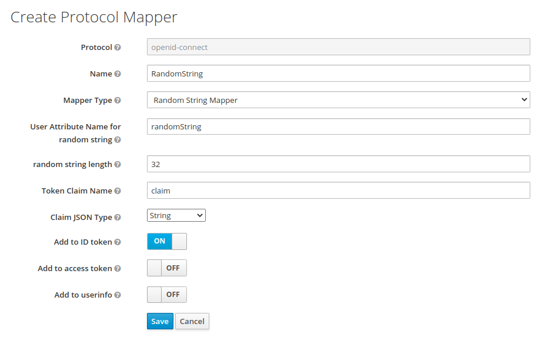

= RandomString OIDC Mapper for Keycloak

RandomString is an OIDC mapper extension for Keycloak. The mapper can generate and save a random string value with a freely definable length per user. It uses a user attribute to store and retrieve the random string value.

== Properties

Specific properties for this mapper:

`userAttribute`::
The User Attribute which is used to fetch/store random string.

`stringLength`::
Length for generated random string. Defaults to 32.

General available OIDC properties of this mapper:

* `Token Claim Name`
* `Claim JSON Type`
* `Add to ID token`
* `Add to access token`
* `Add to userinfo`

This Mapper got realised with the helpful link:https://github.com/thomasdarimont/keycloak-extension-playground[keycloak-extension-playground] of Thomas Darimont.

== Usage

Checkout and build this repo with maven `mvn clean package`. Copy the resulting jar file from `./target` into your Keycloak installation at `standalone/deployments/`.